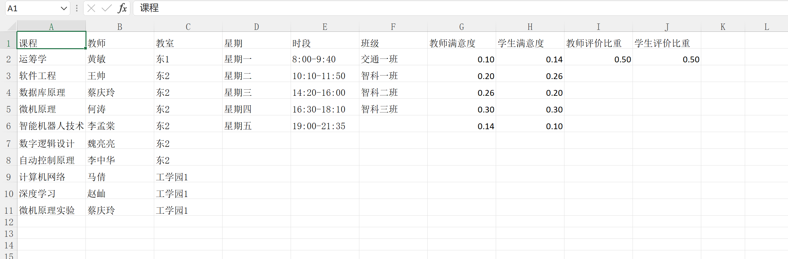

# Course Scheduling
这是运筹学大作业之排课系统中的代码实现部分

## Usage
1. 填写数据
数据采用excel表格导入，后缀为`.xlsx`，的填写**必须按照以下的方式**。
    * 第一行是对应列的数据类型，必须为`课程，教师，教室，星期，时段，班级，教师满意度，学生满意度，教师评价比重，学生评价比重`
    * 第二行以后用来填写该列的数据
    * `课程，教师，教室`三者在同一行一一对应，不可漏写
    * `教师满意度，学生满意度`与`时段`分别在同一行一一对应，不可漏写
    * `教师评价比重，学生评价比重`只需填一行
    * 具体可参考[data.xlsx](data.xlsx)

        

2. 运行方法
打开并运行[main.py](main.py)文件，运行是否成功会输出信息提示。

3. 运行结果
运行成功后，在[result/](./result/)文件夹中有多个按照班级或教师名称命名的`.html`文件，通过浏览器打开即可访问。
